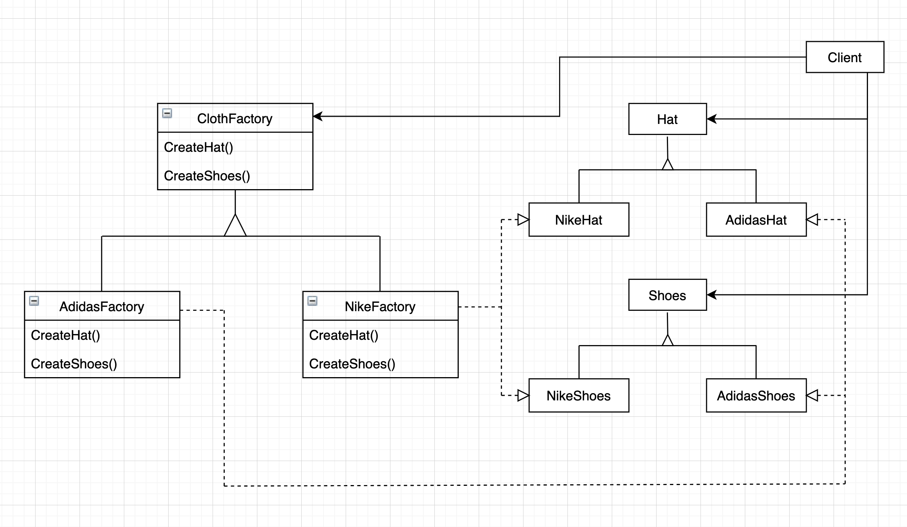
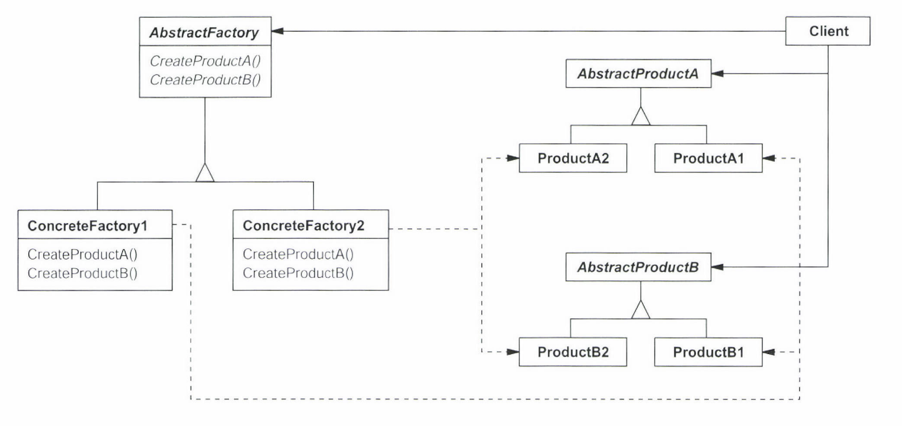
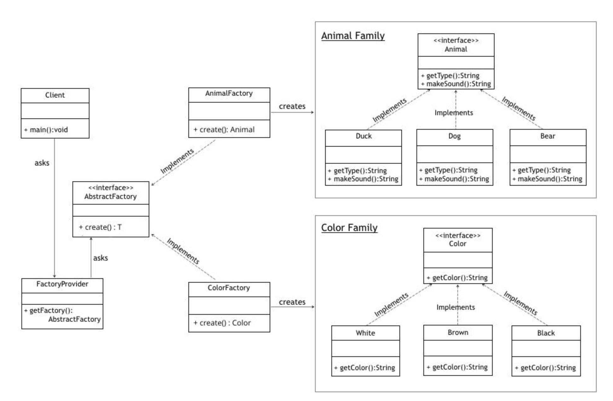

# ABSTRACT FACTORY

### Abstract factory의 의도

- 상세화된 서브클래스를 정의하지 않고도 서로 관련성이 있거나 독립적인 여러 객체의 군을 생성하기 위한 인터페이스 제공

### 다른 이름

- 키트(Kit)

### 예제. 나이키와 아디다스

- 서로 다른 표준, 표현방식, 행동을 가지면서 이식성을 가지려면
    - 구체적 사용자 인터페이스가 아닌 추상 클래스인 ClothFactory를 정의하여 해결
    - ClothFactory는 Cloth의 기본 사용자 인터페이스 요소(Hat,Shoes)를 생성 할 수 있는 인터페이스 정의
        - 사용자는 ClothFactory에 원하는 요소의 인스턴스를 생성하는 연산을 호출
        - 하지만 사용자는 어떤 구체적 서브클래스가 이들 연산을 구현하여 결과를 반환하는지 알 수 없고, 알 필요도 없음
        - 이로써 사용자는 구체적인 Cloth와 분리



## 활용성

- 다음과 같은 경우에 사용
    - 객체가 생성되거나 구성,표현 되는 방식과 무관하게 시스템을 독립적으로 만들고자 할 때
    - 여러 제품군 중 하나를 선택해서 시스템을 설정해야하고 구성한 제품을 대체 할 수 있을 때
    - 관련된 제품 객체들이 함께 사용되도록 설계되억고, 이 부분에 대한 제약에 외부에도 지켜지도록 하고 싶을 때
    - 제품에 대한 클래스 라이브러리르 제공하고, 그들의 구현이 아닌 인터페이스를 노출시키고 싶을 
    - The client is independent of how we create and compose the objects in the system
    - We need a run-time value to construct a particular dependency
    - The system consists of multiple families of objects, and these families are designed to be used togethe

## 참여자



- AbstractFactory : 개념적 제품에 대한 객체를 생성하는 연산으로 인터페이스를 정의
- ConcreteFactory : 구체적인 제품에 대한 객체를 생성하는 연산 구현
- AbstractProduct : 개념적 제품에 대한 인터페이스를 정의
- ConcreteProduct : 구체적으로 팩토리가 생성할 객체를 정의, AbstractProduct의 인터페이스 구현
- Client : AbstractFactory와 AbstractProduct의 인터페이스를 사용

## 협력방법

- 일반적으로 ConcreteFactory 클래스의 인스턴스 한개가 런타임에 만들어지고
- 해당 팩토리를 특정 제품 객체를 생성
- 다른 제품 객체를 생성하려면 다른 ConcreteFactory 사용해야함
- AbstractFactory는 객체 생성 책임을 ConcreteFactory에 위임(delegate)

## 결과

- Profits
    - 구체 클래스를 분리함으로써 사용자는 추상 인터페이스만으로 인스턴스를 조작
    - 전체 제품군을 쉽게 대체 가능 
    - 제품 사이의 일관성 증진(한 군에서 만든 객체를 사용하게 되므로)
   

- Burden
    - 새로운 종류의 제품 추가 어려움(인터페이스, 서브클래스 모두 변경 되어야함)

## 구현 방법
- Singleton Factory : 일반적으로 한 제품군에는 하나의 factory만 필요하므로 적절
- 제품 생성: AbtractFactory는 인터페이스 선언 일뿐 실질적인 제품 생성의 책임은 ConcreteProduct에 있다(ConcreteFactory가 아니라..????) 
    - 이를 위해 각 제품 생성을 위한 팩토리 메서드를 재정의함으로써 각 제품의 인스턴스를 생성
    
## 예제 1
- 제품군이 대체 불가능한 예제라 아래에 예제 2를 추가함
- 출처: https://www.baeldung.com/java-abstract-factory-pattern


- Step 1 : create AbstractProduct   
 
```
    public interface Animal {
        String getAnimal();
        String makeSound();
    }
```  
    
- Step 2 : create ConcreteProduct 

```
    public class Duck implements Animal {
     
        @Override
        public String getAnimal() {
            return "Duck";
        }
     
        @Override
        public String makeSound() {
            return "Squeks";
        }
    }
```

- Step 3 : create AbstractFactory 

```    
    public interface AbstractFactory<T> {
        T create(String animalType) ;
    }
```
    
- Step 4 : create ConcreteFactory 

``` 
    public class AnimalFactory implements AbstractFactory<Animal> {
     
        @Override
    
        public Animal create(String animalType) {
            if ("Dog".equalsIgnoreCase(animalType)) {
                return new Dog();
            } else if ("Duck".equalsIgnoreCase(animalType)) {
                return new Duck();
            }
     
            return null;
        }
     
    }
```
    
- Step 5 : create Factory Generator/Provider  

```
    public class FactoryProvider {
        public static AbstractFactory getFactory(String choice){
             
            if("Animal".equalsIgnoreCase(choice)){
                return new AnimalFactory();
            }
            else if("Color".equalsIgnoreCase(choice)){
                return new ColorFactory();
            }
             
            return null;
        }
    }
```
    
## 예제 2
- 출처: https://www.tutorialspoint.com/design_pattern/abstract_factory_pattern.htm


- Step 1 : Create AbstractProduct  

```
    public interface Shape {
       void draw();
    }
```  
    
- Step 2 : Create ConcreteProduct 

```    
    public class RoundedRectangle implements Shape {
       @Override
       public void draw() {
          System.out.println("Inside RoundedRectangle::draw() method.");
       }
    }
    
    public class RoundedSquare implements Shape {
       @Override
       public void draw() {
          System.out.println("Inside RoundedSquare::draw() method.");
       }
    }
    
    public class Rectangle implements Shape {
       @Override
       public void draw() {
          System.out.println("Inside Rectangle::draw() method.");
       }
    }
```
    
    
- Step 3 : Create AbstractFactory

```
    public abstract class AbstractFactory {
       abstract Shape getShape(String shapeType) ;
    }
```
 
- Step 4 : Create ConcreteFactory 

```
    public class ShapeFactory extends AbstractFactory {
       @Override
       public Shape getShape(String shapeType){    
          if(shapeType.equalsIgnoreCase("RECTANGLE")){
             return new Rectangle();         
          }else if(shapeType.equalsIgnoreCase("SQUARE")){
             return new Square();
          }	 
          return null;
       }
    }
    
    public class RoundedShapeFactory extends AbstractFactory {
       @Override
       public Shape getShape(String shapeType){    
          if(shapeType.equalsIgnoreCase("RECTANGLE")){
             return new RoundedRectangle();         
          }else if(shapeType.equalsIgnoreCase("SQUARE")){
             return new RoundedSquare();
          }	 
          return null;
       }
    }
```
    
- Step 5 : Create Factory Generator/Provider

``` 
    public class FactoryProducer {
       public static AbstractFactory getFactory(boolean rounded){   
          if(rounded){
             return new RoundedShapeFactory();         
          }else{
             return new ShapeFactory();
          }
       }
    }
``` 
    
- Step 6 : Use it    
```
    public class AbstractFactoryPatternDemo {
       public static void main(String[] args) {
          AbstractFactory shapeFactory = FactoryProducer.getFactory(false);
          Shape shape1 = shapeFactory.getShape("RECTANGLE");
          shape1.draw();
          Shape shape2 = shapeFactory.getShape("SQUARE");
          shape2.draw();
          AbstractFactory shapeFactory1 = FactoryProducer.getFactory(true);
          Shape shape3 = shapeFactory1.getShape("RECTANGLE");
          shape3.draw();
          Shape shape4 = shapeFactory1.getShape("SQUARE");
          shape4.draw();
          
       }
    }
```