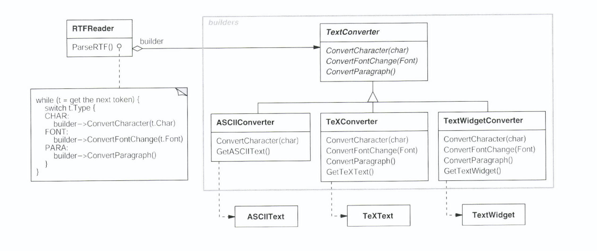
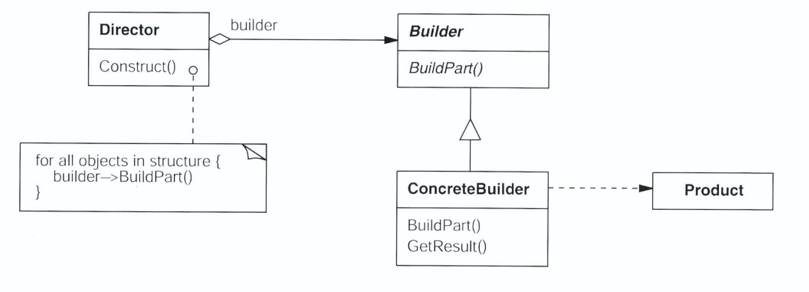
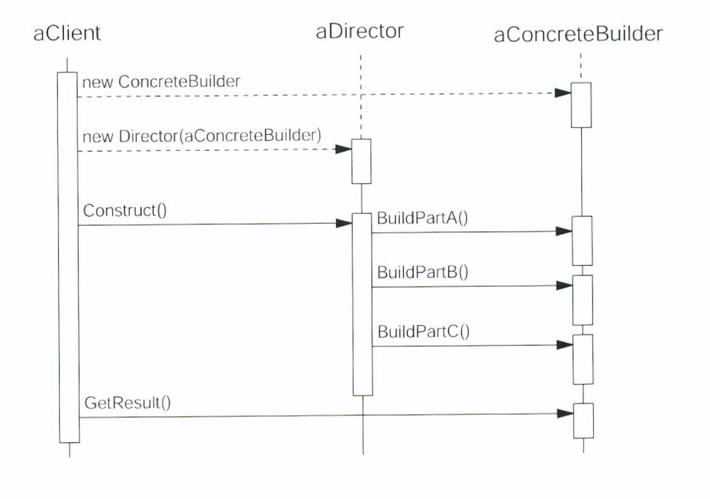

# Builder Pattern

# Introduction

- Java 진영과 GOF 진영에서 언급되는 Builder Pattern은 강조하는 관점이 서로 다름
- GOF에서 설명한 Builder Pattern을 알아보고, Java 진영의 Builder Pattern에 대해서 가볍게 알아보자

## GOF

### Builder Pattern의 의도

- 객체 생성 방법과 표현 방법을 분리
- 각기 다른 기능을 갖고 있는 Concrete 객체에 대한 생성 방법을 하나로 통일

### RTF 문서 판독기의 예제

- 두 부분을 복합하여 사용 (RTFReader / TextConverter)
    - RTFReader - RTF 문서의 책임만 지게 함 (Director)
    - TextConverter - 판독기의 전체 변경 없이 새로운 형태의 변환이 추가될 수 있어야 (Builder)
        - 따라서 Interface로 정의
        - 구상 Class는 다음과 같은 것들이 될 수 있음
            - ASCIIConverter : 일반적인 ASCII Text로의 변환
            - TextWidgetConverter : Tex 형식으로 변환
        - 각 Converter Class들은 객체를 생성하고 조립하는 방법을 Converter Class에 정의된 Interface에 구현함

## 활용성

- 다음과 같은 경우에 사용
    - 복합 객체의 생성 알고리즘이 이를 합성하는 요소 객체들이 무엇인지 이들의 조립 방법에 독립적일 때
    - 합성할 객체들의 표현이 서로 다르더라도 생성 절차에서 이를 지원해야할 떄

## 참여자

- Builder : Product 객체를 생성하기 위한 추상 Interface
    - Product 객체의 종류는 여러가지가 있을 수 있으며, 그 종류에 따라 ConcreteBuilder가 달라진다.
    - 복합 객체인 Product 객체는 여러 Part Object들로 구성이 되어있으며, 각 Part들에 복합을 수행하며 단계적으로 Product를 완성해 나간다.
- ConcreteBuilder :
    - Builder Interface의 구현체
    - Product 생성에 필요한 여러 Part들을 모아 Builder를 복합함
    - 생성한 Product의 표현을 정의하고 관리함
    - Project를 검색하는 데 필요한 Interface를 제공 (GetASCIIText(), GetTextWidget)
        - Product에 대한 추상 Class가 없는 Case
- Director : Builder를 이용해 객체를 생성
- Product : 생성할 복합 객체
- Builder는 부품을 만들고, Director는 Builder가 만든 부품을 조합해 제품을 만든다.

## 협력방법

- Director 객체 생성
- 생성된 객체는 자신이 원하는 Builder 객체로 합성해 나감 (Part에 대한 설정)
- Product의 일부가 Build 될 때마다 Director는 Builder에 통보
- Builder는 Director의 요청을 처리하며 Product에 부품을 추가함
- Client는 Builder에서 제품을 검색

## 결과

- Product에 대한 내부 표현을 다양하게 변화
    - Builder를 사용함으로써 Client에게는 어떠한 Part에 의해 복합되는지 은닉할 수 있게됨
- 생성과 표현에 필요한 코드를 분리
    - Client는 복합 객체의 내부 표현 방법은 전혀 모른 채, 빌더와의 상호작용으로 필요한 복합 객체를 생성
- 복합 객체를 생성하는 절차를 좀 더 세밀하게 나눌 수 있음
    - Director의 통제 아래에서 하나씩 Part를 만들어 나감

## Effective Java

- Parameter가 많다면 Builder Pattern을 고려하라
- 선택적 인자가 많은 Class의 Object를 생성할 때 유연하게 대처할 수 있음

## NutritionFacts의 사례

- 선택적 인자가 많은 경우, 점층적 생성자 패턴 (Telescoping constructor pattern)을 고려해볼 수 있음

    public class NutritionFacts {
            private final int servingSize;  // 필수
            private final int servings;     // 필수
            private final int calories;     // 선택
            private final int fat;          // 선택
            private final int sodium;       // 선택
            private final int carbohydrate; // 선택
    
            public NutritionFacts(int servingSize, int servings, int calories) {
                this(servingSize, servings, calories, 0, 0, 0);
            }
    
            public NutritionFacts(int servingSize, int servings, int calories, int fat) {
                this(servingSize, servings, calories, fat, 0, 0);
            }
    
            public NutritionFacts(int servingSize, int servings, int calories, int fat, int sodium) {
                this(servingSize, servings, calories, fat, sodium, 0);
            }
    
            public NutritionFacts(int servingSize, int servings, int calories, int fat, int sodium,
                                  int carbohydrate) {
                this.servingSize = servingSize;
                this.servings = servings;
                this.calories = calories;
                this.fat = fat;
                this.sodium = sodium;
                this.carbohydrate = carbohydrate;
            }
        }

- 인자 개수에 맞는 생성자를 골라야 함
- 설정할 필요가 없는 필드에도 인위적으로 인자를 전달해야 함
- 점층적 생성자 패턴은 인자 수가 늘어나면 코드 작성이 어려워지고 가독성도 떨어짐

## Java Bean Pattern의 사례

    NutritionFacts nutritionFacts = new NutritionFacts();
    nutritionFacts.setServingSize(30);
    nutritionFacts.setServings(2);
    nutritionFacts.setCalories(5);

- 1회의 함수 호출로 객체 생성 완성을 보장할 수 없으므로, 객체 일관성이 깨질 수 있음
- Immutable class를 만들 수 없음

## Builder Pattern

    public class NutritionFacts {
        private final int servingSize;  // 필수
        private final int servings;     // 필수
        private final int calories;     // 선택
        private final int fat;          // 선택
        private final int sodium;       // 선택
        private final int carbohydrate; // 선택
    
        private NutritionFacts(Builder builder) {
            servingSize = builder.servingSize;
            servings = builder.servings;
            calories = builder.calories;
            fat = builder.fat;
            sodium = builder.sodium;
            carbohydrate = builder.carbohydrate;
        }
    
        public static class Builder {
            private final int servingSize;
            private final int servings;
    
            private int calories;     // 선택
            private int fat;          // 선택
            private int sodium;       // 선택
            private int carbohydrate; // 선택
    
            public Builder(int servingSize, int servings) {
                this.servingSize= servingSize;
                this.servings = servings;
            }
    
            public Builder calories(int calories) {
                this.calories = calories;
                return this;
            }
    
            public Builder fat(int fat) {
                this.fat = fat;
                return this;
            }
    
            public Builder sodium(int sodium) {
                this.sodium = sodium;
                return this;
            }
    
            public Builder carbohydrate(int carbohydrate) {
                this.carbohydrate = carbohydrate;
                return this;
            }
    
            public NutritionFacts build() {
                return new NutritionFacts(this);
            }
        }
    }
    
    NutritionFacts nutritionFacts = new NutritionFacts.Builder(1, 2).calories(100).sodium(35).build();

- Immutable Field는 Builder의 Default Value로 알 수 있음
- 작성하기 쉽고, 가독성도 좋음
- 단점도 있음
    - 점층적 생성자 패턴보다 많은 코드를 요구