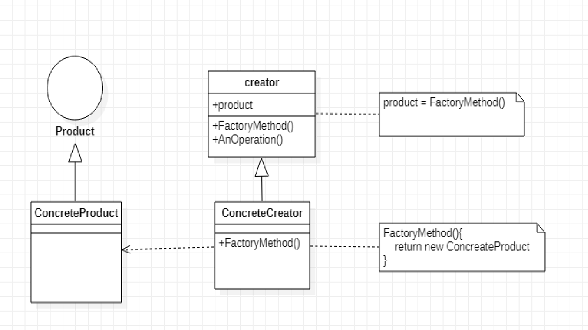

# factory_method
### 다른 이름 : 가상 생성자(Virtual Constructor)

객체를 생성하기 위한 추상클래스를 정의하지만, 어떤 타입의 객체를 생성할 지는 추상클래스의 구현체에서 결정하는 디자인패턴.

부모클래스에서 추상메소드로 정의된 팩토리 메소드를 자식클래스에서 직접 구현하여, 적절한 객체를 반환하도록 한다.  

### 자바에서 사용하는 디자인 패턴
https://stackoverflow.com/questions/1673841/examples-of-gof-design-patterns-in-javas-core-libraries/2707195#2707195

## 구조

- product : 팩토리 메소드가 생성하는 객체의 인터페이스를 정의
- ConcreteProduct : product 클래스에 정의된 인터페이스를 실제로 구현
- Creator : product 타입의 객체를 반환하는 팩토리 메소드를 선언.
Creator 클래스는 팩토리 메소드를 기본적으로 구현하는데, 이 구현에서는 ConcreteProduct 객체를 반환한다. 또한 product 객체의 생성을위해 팩토리 메소드를 호출한다.
- ConcreteCreator : 팩토리 메소드를 재정의하여, ConcreteProduct의 인스턴스를 반환.

## 연관 디자인패턴  - 차후 업데이트 예정
- template_method 
template_method의 생성 패턴 버젼으로 볼 수 있다.

- abstract_factory 
추상 팩토리 패턴은 이 팩토리 메소드를 이용해 구현할 때가 많다. 특히 추상 팩토리 패턴의 '동기'절에서 많이 볼 수 있다.

- prototype 
비슷한 패턴

## 장점과 단점
### 장점
- Product와 Creator 간의 강결합을 막아준다.
Creator클래스에 직접 사용하는 객체를 생성하지 않고, 서브클래스가 생성함으로써 Creator클래스와 Product클래스의 강결합을 막아주며
유동적인 클래스 선언이 가능하다.

- Creator클래스에서 Product에 대한 정보를 캡슐화 함 -> 정보 은닉과 유지보수에 유용

### 단점
- 정석적인 팩토리 메소드 디자인패턴을 따른다면, Product 클래스 하나를 추가할 때 마다 Creator 클래스를 서브클래싱 해야한다.  
이를 피하기 위해서, 팩토리 메소드를 매개변수화 하여 구현하거나 Creator클래스의 FactoryMethod를 일부 구현하기도 한다.

## 구현 방법

1. Creator 클래스를 추상클래스로 정의하여 FactoryMethod를 서브클래스에 위임한다. 가장 정석적인 방법이라 할 수 있다.
2. Creator 클래스의 FactoryMethod에서 기본 구현을 제공한다. 1번 방법에서 예측할 수 없는 클래스를 생성해야 하는 문제를
예방하고, 유연성을 보장한다.
3. 팩토리 메소드를 매개변수화 한다. 하나의 팩토리 메소드에서 여러 종류의 product 인스턴스를 생성할 수 있다.

## 예제 코드
example 디렉토리에 생성