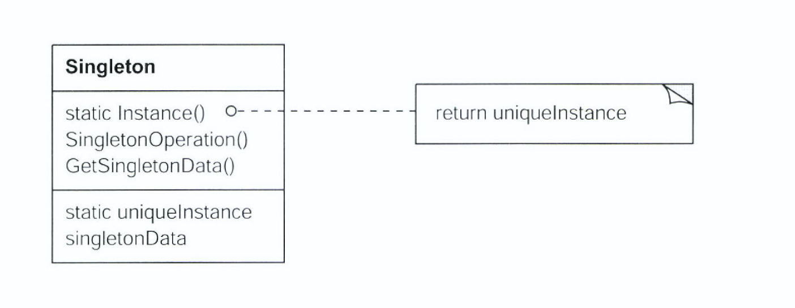

# Singleton

## Singleton Pattern의 의도

- 한 개의 Class Instance만을 갖도록 보장하고 전역적인 접근을 제공

## 동기

- 어떤 Class들은 정확히 하나의 Instance만 존재해야함
    - Printer Spool, File System, Window Manager
- 물론 전역 변수로도 가능함
    - 하지만 Class 자신이 유일한 Instance로 접근하는 방법을 자체적으로 관리하는 방법이 좋음
        - 또 다른 Instance가 생성되지 않도록 할 수 있음
        - 전역 변수는 Life Cycle이 프로그램과 동일함 (Lazy Initialization)

## 활용성

- Class의 Instance가 오직 하나여야 함을 보장하고, 잘 정의된 Access Point로 모든 사용자가 접근할 수 있도록 해야할 때
- 유일한 Instance가 Subclassing으로 확장되어야 하며, 사용자는 코드 수정 없이 확장된 Subclass의 Instnace를 사용할 수 있어야 할 떄

## 구조



- Singleton : Instance() method를 정의하고, 유일한 Instance를 리턴
    - Static method로 정의

## 결과

- 유일하게 존재하는 Instance로의 접근을 통제
- name space를 좁힘
- 연산 및 표현의 정제를 허용
- Instnace의 개수를 변경하기가 자유로움
- Class연산을 사용하는 것보다 훨씬 유연함

## 구현

### Instance가 유일해야 함을 보장하는 구현

```cpp
    class Singleton {
    public:
    	static Singleton* instance();
    protected:
    	Singleton();
    private:
    	static Singleton* _instance;
    }
    
    Singleton* Singleton::_instance = 0;
    
    Singleton* Singleton::instance() {
    	if (_instance == 0) {
    		_instance = new Singleton();
    	}
    
    	return _instance;
    }

    class MazeFactory {
    public:
    	static MazeFactory* instance();
    protected:
    	MazeFactory();
    private:
    	static MazeFactory* _instance;
    }
    
    MazeFactory *MazeFactory::_instance = 0;
    
    MazeFactory* MazeFactory::instance() {
    	if (_instance == 0) {
    		_instance = new MazeFactory;
    	}
    	return _instance;
    }

    public class Singleton {
    	private static Singleton singleton;
    
    	private Singleton() {};
    
    	public static getInstance() {
    		if (singleton == null) {
    			singleton = new Singleton();
    		}
    		return singleton;
    	}
    }
```

- 위와 같이 구현할 수 있음. 정적 변수와 다른 점은 다음과 같음
    - 정적 객체의 유일한 Instance만 선언된다는 보장이 없음
    - 정적 초기화 시점에 모든 Singleton 객체를 Instance화하기 위해 필요한 모든 정보가 없을 수 있음
    - C++에서는 전역 객체에 대한 생성자를 언제 호출하는지에 대한 명확한 순서를 정의하지 않음

### Singleton Class를 Subclassing하는 구현

- Singleton class로부터 subclass 유일한 instance를 생성하는 방법
- Example 1.

```cpp
    class Singleton {
    public:
    	static void Register(const cahr* name, Singleton*);
    	static Singleton* instance();
    protected:
    	static Singleton* lookup(const char* name);
    private:
    	static Singleton* _instance;
    	static List<NameSingletonPair>* _registry;
    }
    
    Singleton* Singleton::instance() {
    	if (_instance == 0) {
    		const char* singletonName = getenv("SINGLETON");
    		_instance = lookup(singletoneName);
    	}
    	return _instance;
    }
    
    MySingleton::MySingleton() {
    	// Singleton instance를 등록
    	Singleton::Register("MySingleton", this);
    }
```

- Example 2.

```cpp
    MazeFactory* MazeFactory::instance() {
    	if (_instance == 0) {
    		const char* mazeStyle = getenv("MAZESTYLE");
    		
    		if (strcmp(mazeStyle, "bombed") == 0) {
    			_instance = new BombedMazeFactory();
    		} else if (strcmp(mazeStyle, "enchanted") == 0) {
    			_instance = new EnchantedMazeFactory();
    		} else {
    			_instance = new MazeFactory();
    		}
    	}
    	return _instance;
    }
```

## Thread-Safe Issue

- 앞서 GOF에서 언급된 Singleton Class들은 Thread-safe  하지 않다는 단점이 있음
    - 객체 생성 시점을 Critical Section에 두어야 함
    - Effective Java : 원소가 하나뿐인 Enum을 이용하는 것

```cpp
    class Singleton {
    private:
    	static std::mutex mutex_;
    protected:
    	Singleton() = default;
    	~Singleton() = default;
    	// Copy constructor 및 대입 연산자 delete
    	Singleton(const Singleton&) = delete;
    	Singleton& operation=(const Singleton&) = delete;
    
    public:
    	static Singleton& Singleton::instance() {
    		if (!instance) {
    			mutex_.lock();
    			instance = new Singleton();
    			mutex_.unlock();
    		}
    		return instance;
    	}
    }
    
    Singleton* Singleton::instance = nullptr;
```

```java
    public class ThreadSafeInitialization {
    	private static ThreadSafeInitialization instance;
    	private ThreadSafeInitialization() {}
    
    	public static synchronized ThreadSafeInitialization getInstance() {
    		if (instance == null) {
    			instance = new ThreadSafeInitialization();
    		}
    		return instance;
    	}
    }
```

- Locking overhead 개선

```java
    public class ThreadSafeInitialization {
    	private static ThreadSafeInitialization instance;
    	private static Object lock = new Object();
    	private ThreadSafeInitialization() {} 
    
    	public static ThreadSafeInitialization getInstance() {
    		if (instance == null) {
    			synchronized(lock) {
    				instance = new ThreadSafeInitialization();
    			}
    		}
    		return instance;
    	}
    }
```

- Meyers Singleton
    - Local Static Variable은
        - C++11부터 block range의 static variable은 thread-safe한 성질을 이용
        - If control enters the declaration concurrently while the variable is being initialized, the concurrent execution shall wait for completion of the initialization. by C++ Standard ([http://www.open-std.org/jtc1/sc22/wg21/docs/papers/2012/n3337.pdf](http://www.open-std.org/jtc1/sc22/wg21/docs/papers/2012/n3337.pdf))

```cpp
    class Singleton {
    private:
    protected:
    	Singleton() = default;
    	~Singleton() = default;
    	// Copy constructor 및 대입 연산자 delete
    	Singleton(const Singleton&) = delete;
    	Singleton& operation=(const Singleton&) = delete;
    
    public:
    	static Singleton& Singleton::instance() {
    		static Singleton intance;
    		return instance;
    	}
    }
```