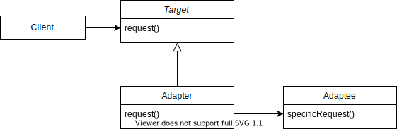

# Adapter

어댑터 패턴에 대해 알아보자.

## Adapter Pattern은 무엇인가


<figcaption>현실세계 어댑터</figcaption>

> 어댑터 패턴은 클래스의 인터페이스를 사용자가 기대하는 다른 인터페이스로 변환하는 패턴으로, 호환성이 없는 인터페이스 때문에 함께 동작할 수 없는 클래스들이 잘 동작할 수 있게 해준다. - 위키피디아



* Client: 타깃 인터페이스를 사용하려는 클라이언트이다.
* Target: 클라이언트가 사용하려고 하는 인터페이스이다.
* Adaptee: 클라이언트가 사용하고 싶지만 (Target Interface와) 규격이 맞지 않는 인터페이스이다.
* Adapter: 클라이언트가 어댑티를 사용할 수 있게 타깃 인터페이스를 구현하는 클래스이다. 어댑터는 타깃 인터페이스의 메시지를 어댑티가 이해할 수 있는 메시지로 변환해서 전달한다.

### Class Adapter


Adapter가 Target과 Adaptee를 모두 상속받아 구현한다. 상속에 제한조건이 있는 프로그래밍 언어에선 제한이 발생할 수도 있다.

> e.g. In Java: Target과 Adaptee가 모두 Class인 경우

### Object adapter


Adapter가 Adaptee 객체를 컴포지션 형태의 프로퍼티로 받아서 어댑터의 구현에서 어댑티를 호출한다.

## 패턴을 사용하는 이유

## 구현해보기: 스마트폰 충전기

[위키피디아의 예](https://en.wikipedia.org/wiki/Adapter_pattern#Java)인 스마트폰 충전기 예제를 구현해보자. 스마트폰은 갤럭시와 아이폰이 존재하고 각각 Micro USB와 라이트닝 규격을 사용한다고 가정한다. 충전기는 오로지 마이크로 USB 충전기만 존재한다. 소스 코드는 [저장소](https://github.com/sshplendid/design-pattern-study)에 있다.

> 아이폰을 사용하는 철수는 배터리 잔량이 얼마 남지않아 충전해야 한다. 영희는 갤럭시 S를 사용하고 Micro USB 규격의 충전기를 가지고 있다. 아이폰은 라이트닝 규격이기 때문에 바로 충전할 수는 없지만 철수는 Micro USB 변환 어댑터를 가지고 있다.

### 어댑터 패턴의 역할에 따른 클래스 대입해보기

* Client: 마이크로 USB 충전기
* Target: 마이크로 USB 규격
* Adaptee: 아이폰
* Adapter: 라이트닝 to Micro USB 변환 어댑터


### 클래스 다이어그램


라이트닝 규격을 사용하는 아이폰(Iphone)은 Micro USB 규격 충전기(MicroUSBCharger)를 바로 사용할 수 없다. 하지만 라이트닝 단자를 Micro USB 규격으로 바꿔주는 어댑터(LigtningToMicroUSBAdapter)를 사용하면 충전기를 사용할 수 있다. 어댑터가 하는 역할은 Micro USB 충전기가 전달하는 메시지를 아이폰이 이해할 수 있는 메시지로 변환하는 것이다.

```java
package shawn.designpattern.adapter;

public class LightningToMicroUSBAdapter implements MicroUSBChargable {

    private LightningChargable lightningChargable;

    public LightningToMicroUSBAdapter(LightningChargable lightningChargable) {
        this.lightningChargable = lightningChargable;
    }

    @Override
    public void connect() {
        System.out.println("마이크로 USB 어댑터를 연결한다.");
        this.lightningChargable.connect();
    }

    @Override
    public void charge() {
        this.lightningChargable.charge();
    }
}
```

## Java API에서의 어댑터 패턴1: `InputStreamReader`

아래 코드는 온라인 코딩 테스트를 보면 자주 작성하는 코드이다. 시스템 입력을 받아 개발자가 핸들링할 수 있게 하는 BufferedReader 객체를 생성한다. BufferedReader 객체는 버퍼 크기만큼의 문자열을 읽을 수 있는 read 메서드를 제공한다. 이 메서드는 내부적으로 InputStream.read를 호출해서 입력 스트림에서 바이트값을 꺼내 문자열로 변환한다.

```java
BufferedReader bufferedReader = new BufferedReader(new InputStreamReader(System.in));
```

아래 테스트 케이스는 파일에 있는 내용을 읽어서 기대한 문자열과 같은지 비교한다. BufferedReader 객체를 사용하는데 File 객체를 FileReader 라는 어댑터로 감싸서 사용한다. FileReader 클래스는 객체를 생성할 때 File을 FileInputStream으로 감싼다. 이 때는 아래와 같이 어댑터 패턴이 적용됐다고 볼 수 있다.

* Client: 테스트 클래스
* Target: BufferedReader (Reader)
* Adaptee: File (FileInputStream)
* Adapter: FileReader (InputStreamReader)

```java
Client Interface: BufferedReader (Reader)
    @Test
    @DisplayName("File 객체를 받아 Reader 객체를 반환하는 BufferedReader")
    void inputStreamReaderTest() {
        // GIVEN
        final String projectPath = System.getProperty("user.dir");
        final String relativePath = "/build/resources/test/hello.txt";

        final File hello = new File(projectPath + relativePath);

        try (BufferedReader bufferedReader = new BufferedReader(new FileReader(hello))) {

            // WHEN
            String contents = bufferedReader.lines().collect(joining("\n"));

            // THEN
            assertThat(contents).isNotNull();
            assertThat(contents).isEqualTo("Hello, World!");
            System.out.println(contents);
        } catch (FileNotFoundException e) {
            e.printStackTrace();
        } catch (IOException e) {
            e.printStackTrace();
        }
    }
```

BufferedReader 클래스는 인자로 Reader 인터페이스의 구현체를 필드로 받는다. 위 코드는 그 구현체로 FileReader 객체를 받는다. FileReader는 InputStreamReader를 상속받고, InputStreamReader는 내부적으로 StreamDecoder라는 Reader 구현체를 필드로 가지고 있다. StreamDecoder는 InputStream 타입의 필드를 가지고 있다. 복잡하게 보이지만 Reader 클래스는 내부적으로 StreamDecoder라는 Reader 구현체가 스트림으로부터 바이트 입력값을 받아 문자열로 변환한다.


## Java API에서의 어댑터 패턴1: `slf4j-jdk14`

SLF4J는 `org.slf4j.Logger`를 로깅 인터페이스로 사용한다. log4j, Logback 등은 이 로거 인터페이스의 구현체이다. SLF4j는 Java 기본 로깅 API인 `java.util.logging.Logger` 라이브러리를 지원하기 위해서 `slf4j-jdk-14` 라이브러리를 제공한다. 이 라이브러리는 기본 로거인 `java.util.logging.Logger`를 래핑한 `JDK14LoggerAdapter`라는 클래스를 제공한다. 이 클래스는 `org.slf4j.Logger`의 구현체이다.(LocationAwareLogger가 Logger를 상속받음)

```java
package org.slf4j.jul;

...
import java.util.logging.Logger;
...

public final class JDK14LoggerAdapter extends MarkerIgnoringBase implements LocationAwareLogger {
    private static final long serialVersionUID = -8053026990503422791L;
    final transient Logger logger; // Java 기본 로거 컴포지션
    static String SELF = JDK14LoggerAdapter.class.getName();
    static String SUPER = MarkerIgnoringBase.class.getName();

    JDK14LoggerAdapter(Logger logger) {
        this.logger = logger;
        this.name = logger.getName();
    }
    ...
    public boolean isInfoEnabled() {
        return this.logger.isLoggable(Level.INFO);
    }

    public void info(String msg) {
        if (this.logger.isLoggable(Level.INFO)) {
            this.log(SELF, Level.INFO, msg, (Throwable)null);
        }

    }

    public void info(String format, Object arg) {
        if (this.logger.isLoggable(Level.INFO)) {
            FormattingTuple ft = MessageFormatter.format(format, arg);
            this.log(SELF, Level.INFO, ft.getMessage(), ft.getThrowable());
        }

    }

    public void info(String format, Object arg1, Object arg2) {
        if (this.logger.isLoggable(Level.INFO)) {
            FormattingTuple ft = MessageFormatter.format(format, arg1, arg2);
            this.log(SELF, Level.INFO, ft.getMessage(), ft.getThrowable());
        }

    }

    public void info(String format, Object... argArray) {
        if (this.logger.isLoggable(Level.INFO)) {
            FormattingTuple ft = MessageFormatter.arrayFormat(format, argArray);
            this.log(SELF, Level.INFO, ft.getMessage(), ft.getThrowable());
        }

    }

    public void info(String msg, Throwable t) {
        if (this.logger.isLoggable(Level.INFO)) {
            this.log(SELF, Level.INFO, msg, t);
        }

    }
    ...
}
```

## 특징

* 장점
  * 단일 책임 원칙(Single Responsibility Principle)에 기반한 코드를 작성한다. 실제 비즈니스 로직으로부터 인터페이스나 데이터 변환 코드를 분리시킬 수 있다.
  * 개방 폐쇄 원칙(Open/Closed Principle)에 기반한 코드를 작성한다. 어댑터를 통해 클라이언트 인터페이스를 사용하면 기존에 작성한 클라이언트 코드를 변경하지 않고도 새로운 어댑터를 도입할 수 있다.
* 단점
  * 코드의 복잡도가 증가한다. 어댑터와 같은 새로운 인터페이스가 생기기 때문 이다. 가끔은 서비스 코드를 변경하는데 더 간단할 수 있다.

## 다른 패턴과의 관계

[Refactoring guru](https://refactoring.guru/design-patterns/adapter)에 따르면 어댑터 패턴과 연관된 다른 패턴에 대해서 알 수 있다.

* 브릿지 패턴은 초반에 설계되어서, 개발자가 애플리케이션의 일부분을 다른 부분들과 독립적으로 개발할 수 있게 한다. 반면에 어댑터 패턴은 보통 기존에 존재하는 애플리케이션과 호환되지 않는 클래스가 함께 잘 작동하게 도와준다.
* 어댑터 패턴은 기존에 존재하는 객체의 인터페이스를 변경한다. 반면에 데코레이터 패턴은 인터페이스의 변경없이 객체를 향상시킨다. 추가로 데코레이터 패턴은 재귀적 구성(Composition)을 지원하지만, 어댑터를 사용할 땐 불가능하다.
* 어댑터 패턴은 대상 객체를 감싼 다양한 인터페이스를 제공한다. 프록시 패턴은 객체와 동일한 인터페이스를 제공하고, 데코레이터 패턴은 기존 객체보다 향상된 객체를 제공한다.
* 퍼사드 패턴은 기존 객체에 대한 새로운 인터페이스를 제공한다. 반면 어댑터 패턴은 기존에 존재하는 인터페이스를 사용 가능하도록 한다. 보통 어댑터는 단지 객체를 감싸기만 한다. 그러나 퍼사드는 객체의 내부 시스템과 긴밀하게 동작한다.
* 브릿지, 스테이트, 스트레티지와 몇몇 어댑터는 유사한 구조를 가진다. 이 패턴들은 다른 객체들을 대신해서 동작하는 컴포지션에 기반한다. 그러나 모두 다른 종류의 문제를 해결한다. 패턴은 특정한 방식으로 코드를 구성하기 위한 레시피가 아니다. 또한 다른 개발자들과 문제 해결하기 위해 사용한 패턴에 대해 의견을 나눌 수 있다.